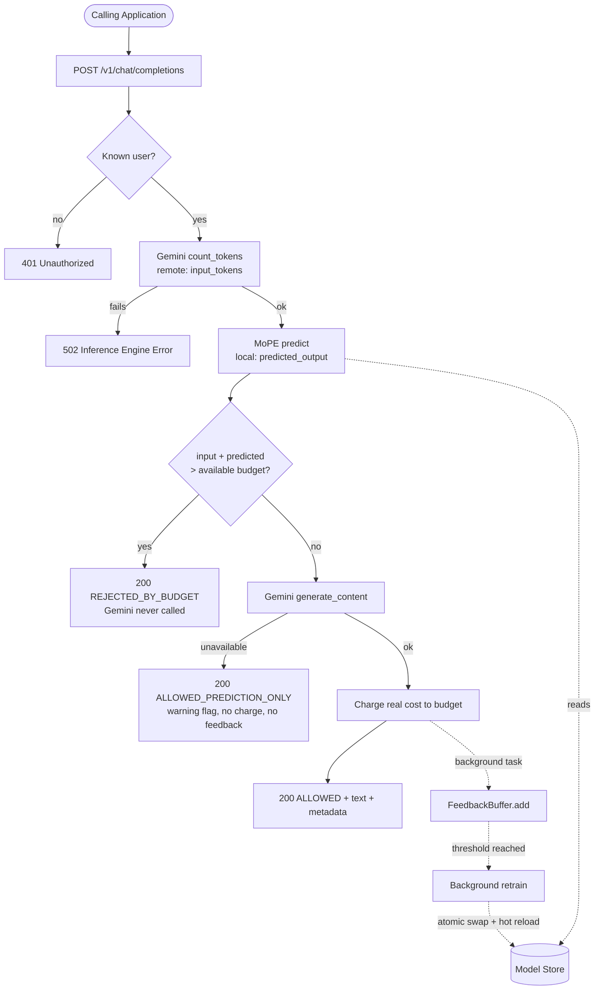

# Architecture

## What this system does

The middleware sits between a calling application and the Gemini API. For every
request it estimates the total token cost up front and enforces a per-user budget,
rejecting requests that would exceed the budget *before* the generation
call runs.

```
Calling application
        │
        ▼
  ┌───────────────┐
  │  Middleware   │  ← estimates cost, enforces budget, learns from outcomes
  └───────────────┘
        │
        ▼
    Gemini API
```

## Design intent vs. current implementation

This is a reference implementation; some of the naming describes the design
direction rather than what is wired today. Stated honestly:

| Concept | Design intent | Current implementation |
|---|---|---|
| **MoPE** (Mixture of Prediction Experts) | A router dispatching prompts to per-domain expert regressors (code / summarization / chat). | A **single** `TfidfVectorizer` + `GradientBoostingRegressor`. `subject` is recorded in the dataset but not yet used to route. |
| **Input tokenizer** | A local tokenizer for zero-network input counting. | A **remote** `gemini.count_tokens()` call (one extra round-trip). |
| **Feedback loss** | — | **Quantile regression** (pinball loss, q=0.85). Prediction error (`actual − predicted`) is tracked/logged for drift visibility. |

## Components

| Module | Responsibility |
|---|---|
| `app/main.py` | App factory; loads artifacts + configures Gemini in the lifespan handler. |
| `app/config.py` | Single typed `Settings` object (all env vars, all paths). |
| `app/routers/chat.py` | The budget-guardrail hot path (`/v1/chat/completions`). |
| `app/routers/admin.py` | Retrain trigger/status and dataset generation. |
| `app/routers/health.py` | `/health` readiness probe. |
| `app/services/gemini_client.py` | Wraps `count_tokens` + `generate_content`; runs blocking SDK calls in a threadpool; raises typed errors. |
| `app/services/predictor.py` | Vectorize → regress; conservative fallback when no model is loaded. |
| `app/services/model_store.py` | Thread-safe, hot-swappable holder for the artifacts. |
| `app/services/budget.py` | In-memory per-user quota store (Redis-ready interface). |
| `app/services/retrain.py` | `FeedbackBuffer` + background retrain + atomic swap + hot reload. |
| `app/training/pipeline.py` | Shared `train()` used by both the CLI and the retrainer. |
| `app/training/train_proxy.py` | Offline training CLI (dataset → `.pkl`). |
| `app/training/generate_dataset.py` | Builds `dataset.json` by querying Gemini over `prompts.json`. |

## Request flow



## Concurrency model

- **Request path is async.** The two blocking Gemini SDK calls are offloaded with
  `run_in_threadpool`, so a slow upstream call never stalls the event loop.
- **Feedback is decoupled** from the HTTP response via FastAPI `BackgroundTasks`:
  the response returns immediately after the budget is charged; recording the
  feedback (and possibly scheduling a retrain) happens after the response is sent.
- **Retraining is CPU-bound** and runs on a single-worker `ThreadPoolExecutor`,
  never on the event loop. New artifacts are written to temp files and swapped in
  with `os.replace` (atomic on Unix), then hot-reloaded under a lock in the model
  store — no server restart, in-flight requests finish on the old model.

## Known limitations (v0.1)

- Quota store and feedback buffer are **in-memory** — both reset on restart.
- A single Gemini model; no real per-domain expert routing yet.
- `count_tokens` is a remote call, so "marginal latency" still includes one
  lightweight round-trip.
- Depends on the deprecated `google-generativeai` SDK.
